# Electronic Store
Creating a backend for an electric store application involves several key components and functionalities to ensure smooth operations for managing products, handling orders, and maintaining customer relationships

## Features

- **User Management**: CRUD operations for users.
- **Product Management**: CRUD operations for products.
- **Category Management**: CRUD operations for product categories.
- **Order Management**: Create, get, and delete orders.
- **Cart Management**: Add, get, and remove items from the shopping cart.

## Technologies Used
* Java
* Spring Boot
* MySQL
* AWS
* Docker
* Maven

## Using the Application
### Installation

1. **Clone the Repository**
  https://github.com/aditee99/electronic-store.git
2. **Set up the MySQL database:**
    - Create a database named `electronic_store`.
    - Update the `application.properties` file with your MySQL database credentials.
3.  **Build the project:**
    ```bash
    mvn clean install
    ```
4. **Run the application:**
    ```bash
    mvn spring-boot:run
    ```
### Deployment to AWS

1. **Set up an AWS EC2 instance:**
    - Log in to the AWS Management Console.
    - Launch an EC2 instance with an appropriate instance type.
    - SSH into the EC2 instance:
     
    To connect to your EC2 instance, use the following SSH command. Make sure you replace `"path/to/KeyPair"` with the actual path to your key pair file.

    ```sh
    ssh -i "path/to/KeyPair" ubuntu@ec2-13-127-253-139.ap-south-1.compute.amazonaws.com

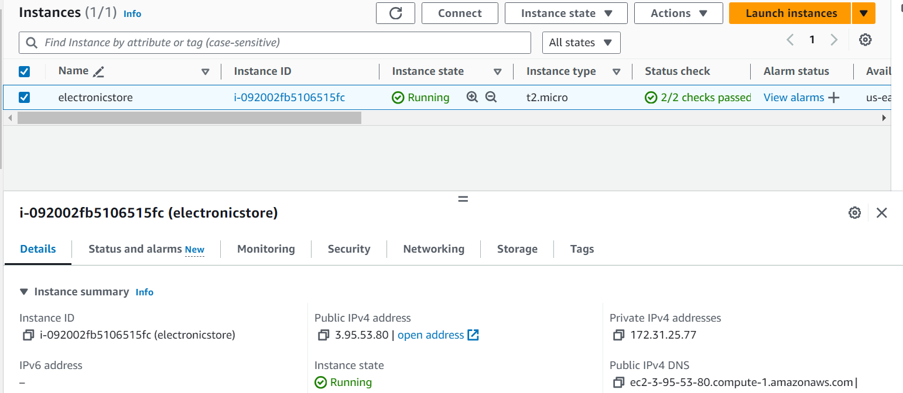

2. **Deploying Project: Image from Docker Hub and running from the EC2 instance:**
    ```bash
     sudo su
     apt update
     apt upgrade
    ```
    Remove any docker files that are running in the system:  
    ```bash
    apt-get remove docker docker-engine docker.io
     ```
    Install docker:
   ```bash
    apt install docker.io
    ```
    Create Network:
   ```bash
    docker network create networkName
   ```
    Run Mysql:
   ```bash
    docker run -d --name mysqldb -p 3308:3306 --network=networkName  -e MYSQL_ROOT_PASSWORD=root -e MYSQL_DATABASE=electronic_store -v /projects/data:/var/lib/mysql mysql
   ```
    Run Application:
   ```bash
   docker run -d --name store -p 9091:9090 --network=bootApp -e MYSQL_HOST=mysqldb -e MYSQL_PORT=3306 -v /projects/images:/images aditeeadhikari98408/electronic1.0!
   ```
3.**Adding Inbound Rule**
   Add inbound rule at port 9091
   
   
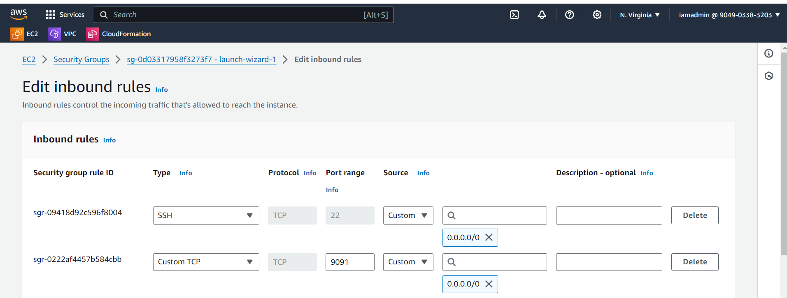


4. **Associating Elastic IP**
   
   
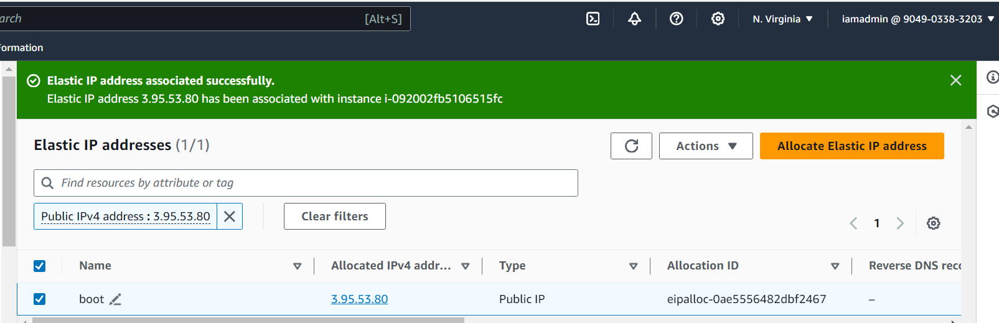


5. **Swagger Endpoint for Electronic Store**
   

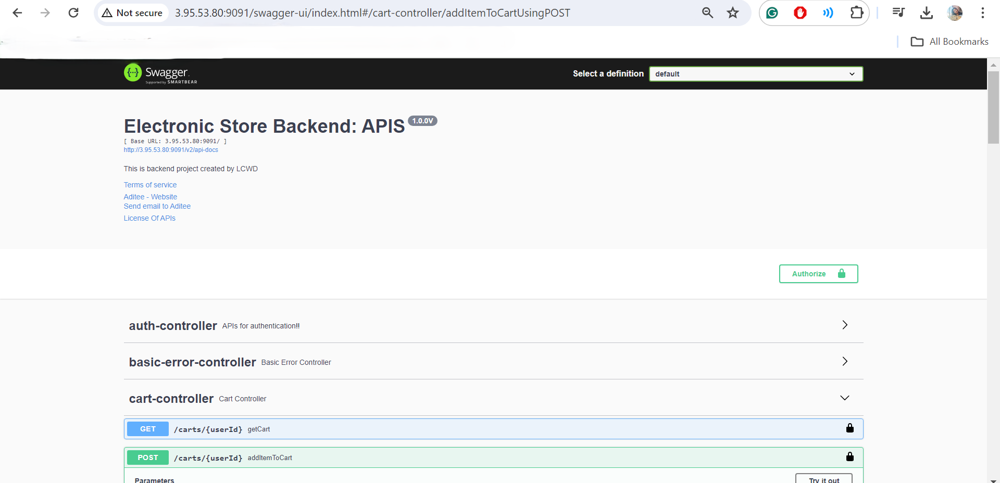


## Some of the Postman and Swagger Responses

1. **Create User**

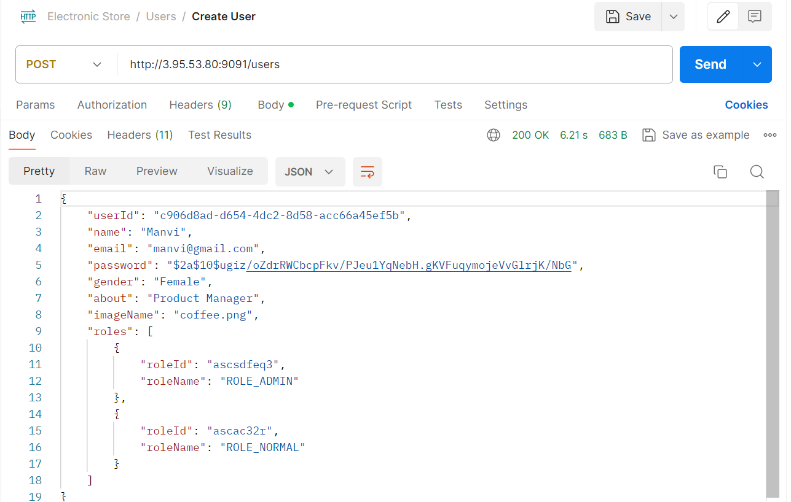

2. **Login User**

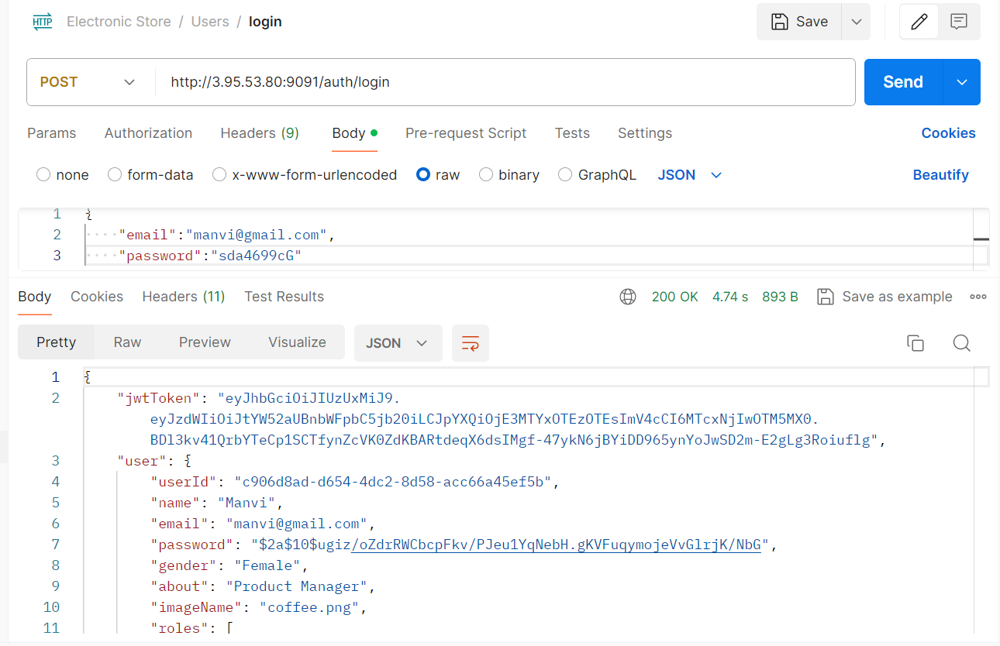

3. **Authorization in Swagger using JWT Token**

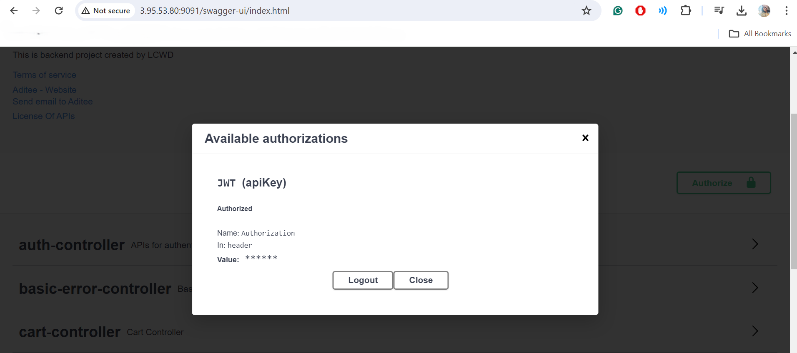

4. **Get Users**

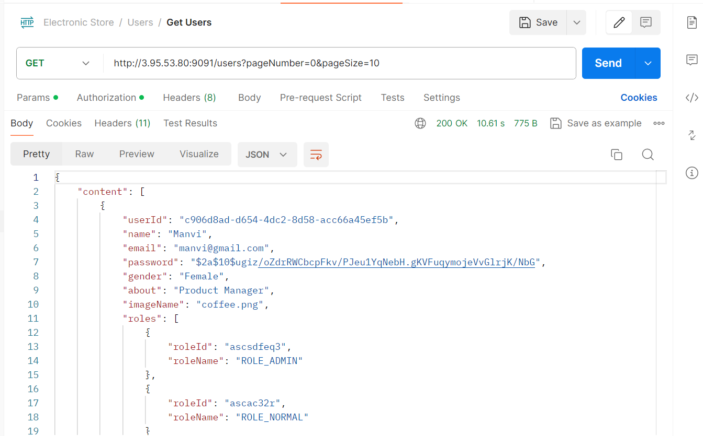

5. **Get User by Id**
   
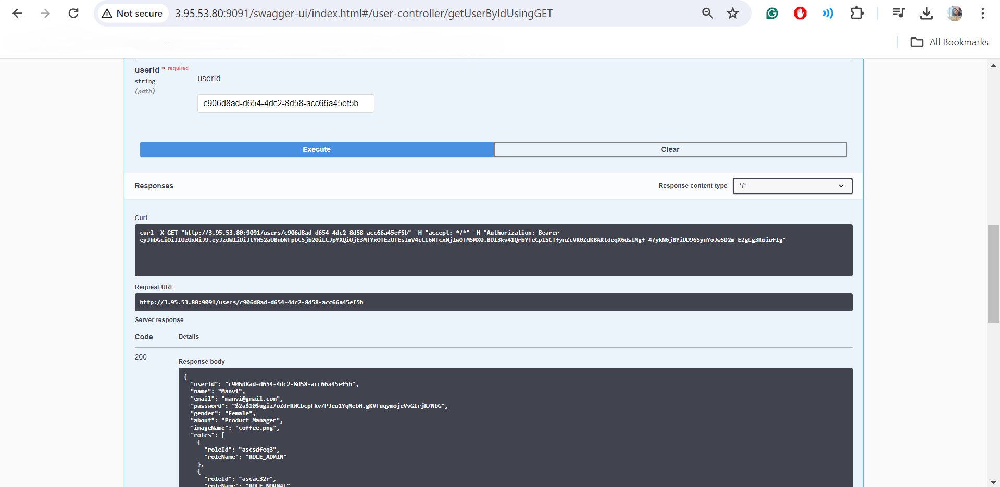

6. **Create Product**

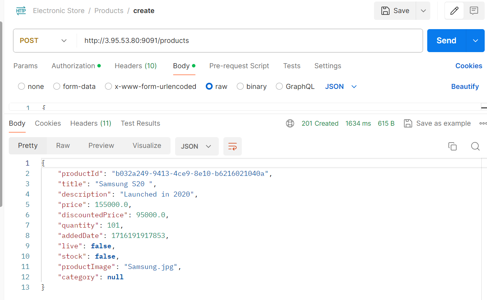

7. **Get Product**

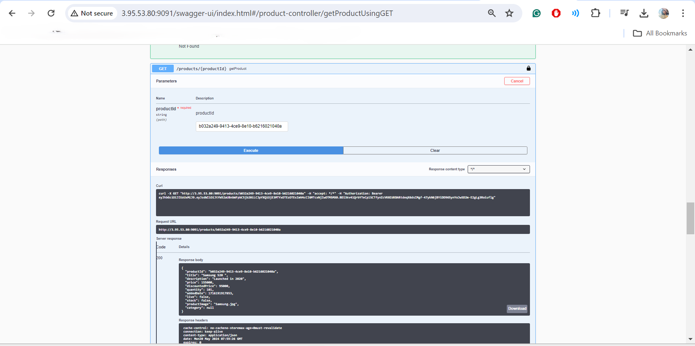

8. **Upload Product Image**

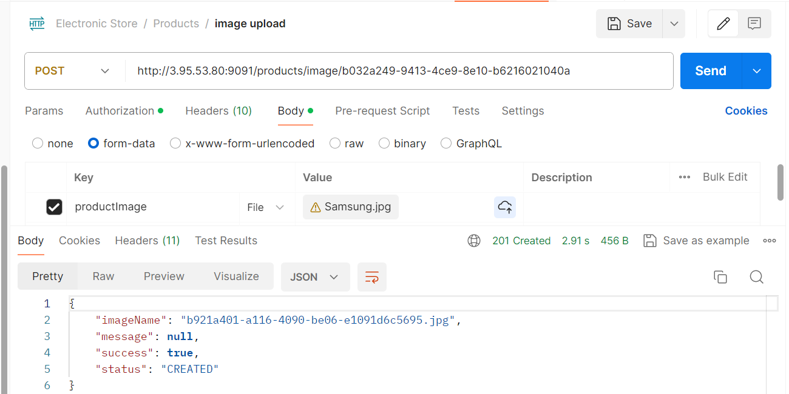

9. **Get Product Image**

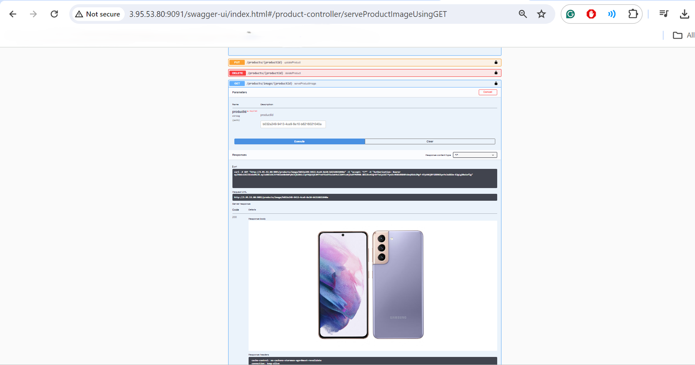

## Connecting to Database in Docker through SSH Connect

1. - SSH into the EC2 instance:
      ```bash
      ssh -i "path/to/KeyPair" ubuntu@ec2-13-127-253-139.ap-south-1.compute.amazonaws.com
     ```
2. ```bash
     sudo su
    ```
3. ```bash
     docker exec -it mysqldb bash
    ```
4. ```bash
   Mysql -u root --port 3308 -p
   ```
5. ```bash
   show databases;
   use electronic_store
   show tables;
   select * from users
    ```
 6. MySQL response :
    


   
  


